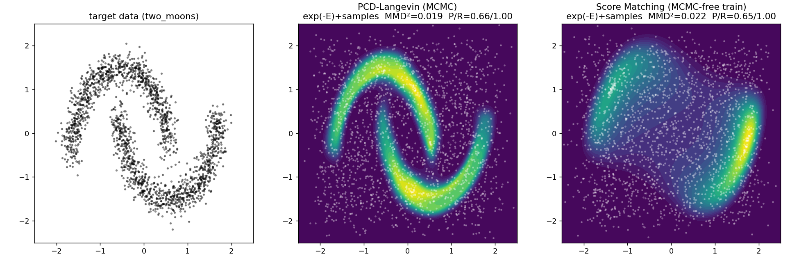
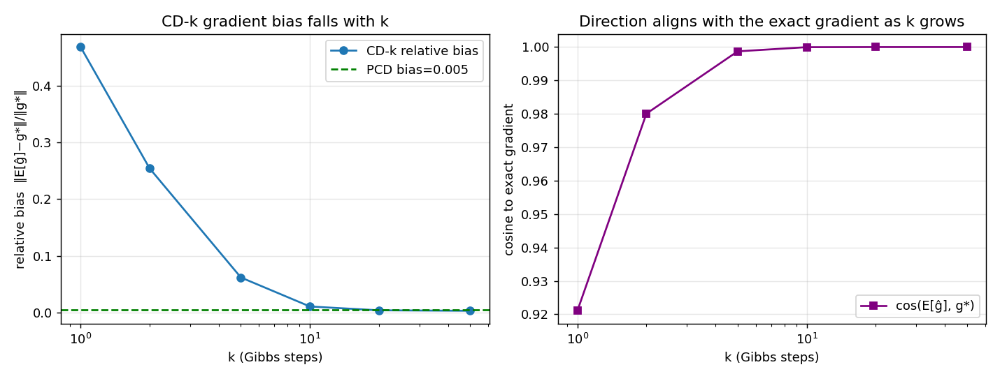
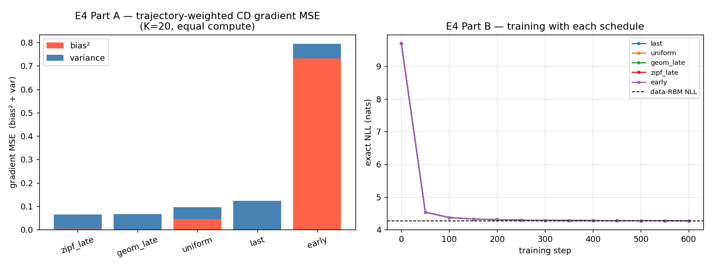
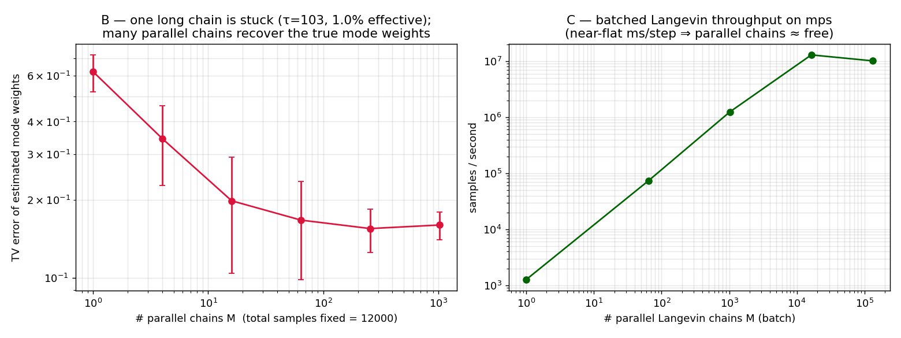
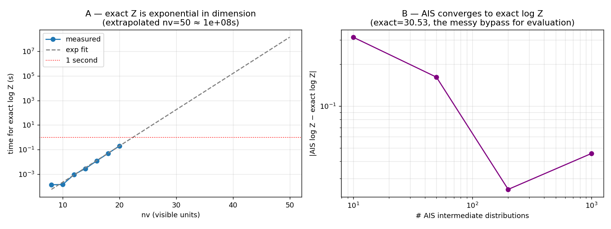

# Experiment 10 — Results (MCMC / Contrastive Divergence / Z)

Auto-generated by `src/make_report.py` from `results/*.json`. See `ANSWERS.md` for the prose answers to all 9 questions and `README.md` for the map.

## E1 — Continuous EBM without Z (RQ1, RQ2, Q3, Q5)

Target `two_moons`, MLP energy, 3000 steps on `mps`. `Z` was never computed.

| method | MCMC in training? | MMD² to data ↓ | precision | recall |
| --- | --- | ---: | ---: | ---: |
| data vs data (floor) | — | 0.0005 | 1.00 | 1.00 |
| **PCD-Langevin** | yes | 0.0194 | 0.66 | 1.00 |
| **score matching (DSM)** | **no** | 0.0221 | 0.65 | 1.00 |
| uniform noise (ceiling) | — | 0.0436 | — | — |

## E2 — Short-run CD is *biased*, not just noisy (Q6, Q7)

Tiny RBM, exact MLE gradient by enumeration; `eval` model ≠ data (CD bias vanishes at the data params). Bias falls monotonically with `k`; at small `k` it dominates the MSE.

| estimator | rel. bias ↓ | cosine to g* | variance | MSE |
| --- | ---: | ---: | ---: | ---: |
| CD-1 | 0.4679 | 0.9211 | 0.123 | 3.168 |
| CD-2 | 0.2539 | 0.9801 | 0.132 | 1.029 |
| CD-5 | 0.0617 | 0.9987 | 0.126 | 0.179 |
| CD-10 | 0.0106 | 1.0000 | 0.130 | 0.131 |
| CD-20 | 0.0038 | 1.0000 | 0.124 | 0.125 |
| CD-50 | 0.0030 | 1.0000 | 0.122 | 0.122 |
| **PCD** (1 step/iter) | 0.0045 | 1.0000 | 0.123 | 0.124 |

## E4 — Trajectory-weighted CD: late-weighting wins (Q8, Q9)

Same RBM, `K=20` Gibbs steps, equal compute. A weighted negative phase `Σ_t w_t·stats(v^(t))`. **Late-weighted averaging keeps CD-K's low bias but halves the variance → ~2× lower gradient MSE than vanilla last-only CD.**

| schedule | rel. bias ↓ | variance ↓ | gradient MSE ↓ |
| --- | ---: | ---: | ---: |
| **zipf_late** | 0.0185 | 0.0592 | 0.0640 |
| **geom_late** | 0.0037 | 0.0667 | 0.0669 |
| uniform | 0.0564 | 0.0514 | 0.0957 |
| last | 0.0040 | 0.1230 | 0.1233 |
| early | 0.2294 | 0.0626 | 0.7944 |

End-task (exact NLL after training; data-RBM NLL = 4.261): uniform=4.2700, geom_late=4.2701, zipf_late=4.2701, early=4.2704, last=4.2716

### Independent cross-check (Codex, from-scratch numpy)

Two independent implementations agree to ~2–3 significant figures:

| quantity | this impl | Codex impl |
| --- | ---: | ---: |
| CD-1 rel. bias | 0.4679 | 0.4680 |
| PCD rel. bias | 0.0045 | 0.0043 |
| E4 best schedule | zipf_late | zipf_late |
| E4 zipf_late MSE | 0.0640 | 0.0623 |

## E3 — Parallel / persistent chains beat one long chain (Q4, Q9)

One long Langevin chain on a 3-mode mixture is stuck: τ=103, only 1.0% of samples are effective, single-chain mode weights `[0.0, 1.0, 0.0]` vs true `[0.33, 0.33, 0.33]`.

Mode-weight error (TV) vs #chains at fixed total samples:

| # chains M | TV error ↓ |
| --- | ---: |
| 1 | 0.622 ± 0.101 |
| 4 | 0.344 ± 0.116 |
| 16 | 0.198 ± 0.094 |
| 64 | 0.167 ± 0.068 |
| 256 | 0.155 ± 0.030 |
| 1024 | 0.160 ± 0.020 |

Batched Langevin throughput on `mps` (near-flat ms/step ⇒ parallel chains ≈ free):

| # chains | ms / step | samples / s |
| --- | ---: | ---: |
| 1 | 0.79 | 1.27e+03 |
| 64 | 0.87 | 7.36e+04 |
| 1024 | 0.82 | 1.25e+06 |
| 16384 | 1.26 | 1.30e+07 |
| 131072 | 12.89 | 1.02e+07 |

## E5 — Z is exponential but only needed for likelihood (RQ1, Q6)

Exact `log Z` by enumeration scales as `2^nv` (fit slope 0.295 decades/bit ≈ ×2/bit). Extrapolated: nv=50 → 1.4e+08s, nv=100 → 8.0e+22s.

AIS (the messy bypass) converges to exact `log Z` = 30.53:

| # AIS levels | log Z est | |error| |
| --- | ---: | ---: |
| 10 | 30.218 ± 0.664 | 0.3132 |
| 50 | 30.693 ± 0.207 | 0.1614 |
| 200 | 30.556 ± 0.166 | 0.0251 |
| 1000 | 30.577 ± 0.044 | 0.0455 |

`Z` is needed for: normalized_likelihood.
`Z` is NOT needed for: sampling_gibbs_langevin, energy_landscape_argmax, score_matching_training, contrastive_divergence_training.

